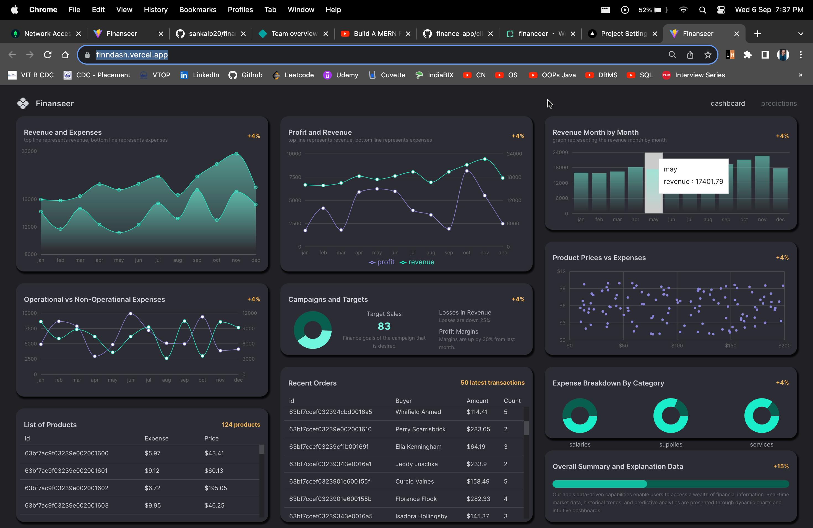
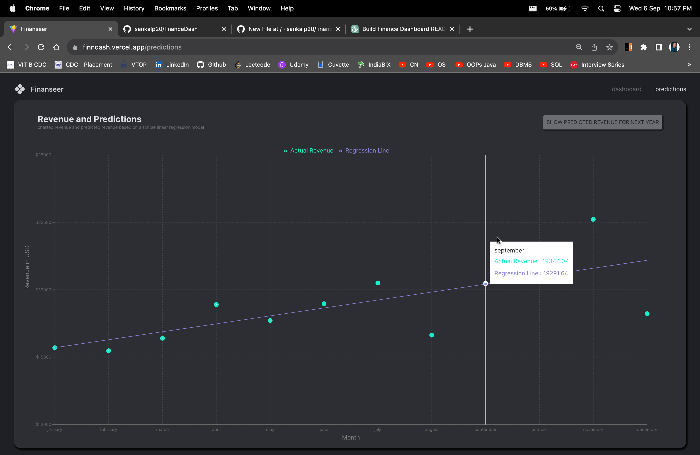

# Finanseer : Finance Dashboard 
Welcome to Finance Dashboard, your all-in-one financial companion built using the MERN stack! This powerful web application empowers users to access a wealth of financial information, enabling you to make informed investment decisions with confidence.

## The Dashboard

#### Live Website
[Click Here](https://finndash.vercel.app/) 

## Features
- Real-time market data: Stay up-to-date with the latest market trends and stock prices.
- Historical trends: Analyze historical data to spot patterns and make data-driven investment choices.
- Predictive analytics: Leverage predictive insights to plan your financial future.
- Dynamic charts: Visualize data using interactive and user-friendly charts.
- Intuitive dashboards: Get a comprehensive overview of your financial portfolio.
- Portfolio tracking: Keep tabs on your investments and monitor their performance.
- Personalized recommendations: Receive tailored financial advice based on your goals and preferences.

## Technologies Used
#### Frontend Stacks
- Framework: ReactJs
- Component Library and Data Grid Tables: Material UI
- Starter App: Vite
- Charts Library: Recharts
- Management and API Calls: Redux
- Icons: Heroicons
- Navigations: React Router

#### Backend Stacks
- Runtime: NodeJs
- Framework: ExpressJs
- Database: Mongoose

##### Machine Learning Model
- ML Prediction - RegressionJs

## Getting Started
I welcome every techie to add something new and creative so as to get it more productive than now!

To get started with Finance Dashboard, follow these simple steps:

###### Clone the repository to your local machine:
- git clone https://github.com/your-username/finance-dashboard.git

###### Install dependencies for both the frontend and backend:
- cd finance-dashboard
- cd client && npm install
- cd ../server && npm install

###### Configure your MongoDB connection in the server's .env file.
###### Start the development server for both frontend and backend.
- cd client && npm start
- cd ../server && npm start

###### Access the app in your web browser at http://localhost:3000.

## Contact
Have questions or feedback? Feel free to reach out to me at sankalpforwork@gmail.com.

